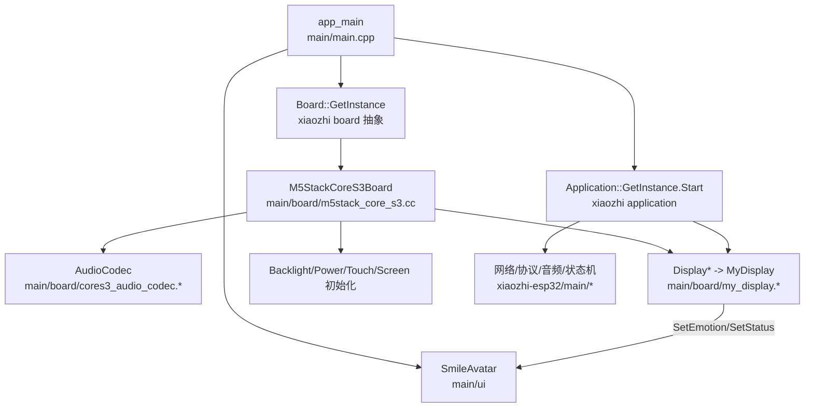
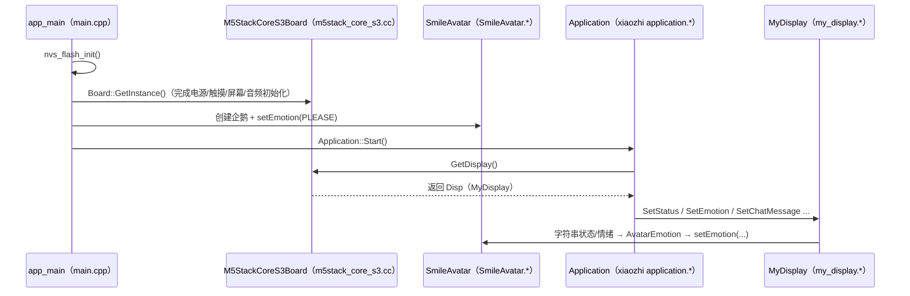
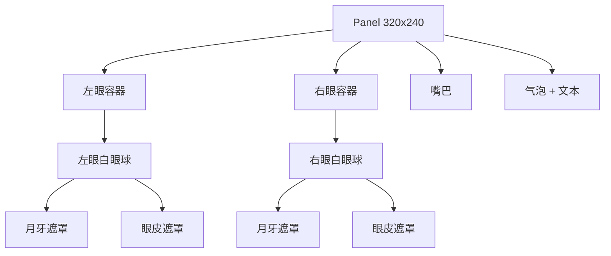

# 工程代码架构（M5StackS3Learn）

本文件描述当前仓库的整体代码组织方式，以及本工程如何把 `xiaozhi-esp32` 的“应用/协议/音频/状态机”编译进来，并通过 `Display` 桥接层把小智的 UI 输出映射到企鹅表情 UI（SmileAvatar）。

## 顶层目录结构（按当前仓库）

```text
e:/ESP/M5StackS3Learn
├─ main/                           # ESP-IDF 的 main 组件（本工程唯一应用组件）
│  ├─ main.cpp                     # 入口：NVS → Board → 创建企鹅 UI → Application::Start()
│  ├─ CMakeLists.txt               # 关键：把 xiaozhi-esp32/main/ 作为源码加入 main 组件编译
│  ├─ Kconfig.projbuild
│  ├─ idf_component.yml            # 官方依赖（ESP-IDF 组件管理器）
│  ├─ ui/
│  │  ├─ SmileAvatar.h
│  │  └─ SmileAvatar.cc
│  └─ board/
│     ├─ m5stack_core_s3.cc        # CoreS3 板级适配（实现 WifiBoard）
│     ├─ my_display.h/.cc          # Display 桥接：SetEmotion/SetStatus → SmileAvatar
│     ├─ cores3_audio_codec.h/.cc  # 音频 codec 适配
│     ├─ config.h / config.json
│     └─ README.md
├─ xiaozhi-esp32/                  # 小智上游源码树（由脚本拉取；被 main/CMakeLists.txt 编译引用）
├─ repos.json                      # 第三方仓库清单
├─ fetch_repos.py                  # 拉取/更新第三方依赖脚本（git clone/fetch/checkout）
├─ dependencies.lock               # ESP-IDF 组件管理器依赖锁（锁版本/哈希）
├─ README.md
└─ CodeArchitecture.md             # 本文件
```

说明：

- `components/` 与 `managed_components/` 会在拉取/构建时生成，但通常在 [.gitignore](file:///e:/ESP/M5StackS3Learn/.gitignore) 中被忽略提交。

## 依赖获取方式

- ESP-IDF 组件管理器（官方依赖）
  - 清单：[main/idf\_component.yml](file:///e:/ESP/M5StackS3Learn/main/idf_component.yml)
  - 锁文件：[dependencies.lock](file:///e:/ESP/M5StackS3Learn/dependencies.lock)
  - 典型目录：`managed_components/`（构建生成，通常不提交）
- 脚本拉取（第三方/上游源码）
  - 清单：[repos.json](file:///e:/ESP/M5StackS3Learn/repos.json)
  - 执行：`python fetch_repos.py`
  - 拉取内容：
    - `xiaozhi-esp32/`（本工程会直接编译其中 `xiaozhi-esp32/main/` 的源码）
    - `components/`（如 `smooth_ui_toolkit`、`ArduinoJson`、`esp-now`、`esp-sr` 等；通常不提交）

## 编译结构（main 组件如何“吸收”小智）

[main/CMakeLists.txt](file:///e:/ESP/M5StackS3Learn/main/CMakeLists.txt) 做了两件关键事情：

1. 将本工程自身源文件（`main.cpp` + `board/*` + `ui/*`）加入 `main` 组件
2. 将 `xiaozhi-esp32/main/` 的大量源文件（application/audio/display/protocols/settings/assets/ota 等）加入同一个 `main` 组件一起编译，并嵌入多语言提示音（`EMBED_FILES`）

## 模块关系（逻辑视角）



## 运行时数据流（当前实现）



## UI 结构（企鹅头像，概念图）



## xiaozhi-esp32 结构定位（本工程视角）

`xiaozhi-esp32/` 在本仓库中作为“上游源码树”存在，本工程通过 CMake 直接编译其 `main/` 下的核心模块：

```text
xiaozhi-esp32/main/
├─ application.*          # 应用调度/状态机入口
├─ audio/                 # 音频服务/处理器/唤醒词
├─ protocols/             # WebSocket / MQTT / MCP 等协议实现
├─ display/               # LVGL 显示实现（本工程用 MyDisplay 接管其 Display 输出）
├─ assets.* / settings.*  # 资源与设置
└─ ota.*                  # OTA 等系统功能
```

本工程的关键集成点是：**实现一个符合小智 Display 接口的 MyDisplay**，把 `SetEmotion/SetStatus/...` 这些“UI 输出”改为驱动 `SmileAvatar`（并通过 `lvgl_port_lock` 保证线程安全）。

## 典型开发流程摘要

1. 拉取代码
2. 拉取/更新上游与第三方依赖：

```bash
python fetch_repos.py
```

1. 构建时自动拉取官方组件（或手动先执行一次）：

```bash
idf.py reconfigure
```

1. 编译 / 烧录 / 串口：

```bash
idf.py set-target esp32s3
idf.py build
idf.py -p COMx flash monitor
```

