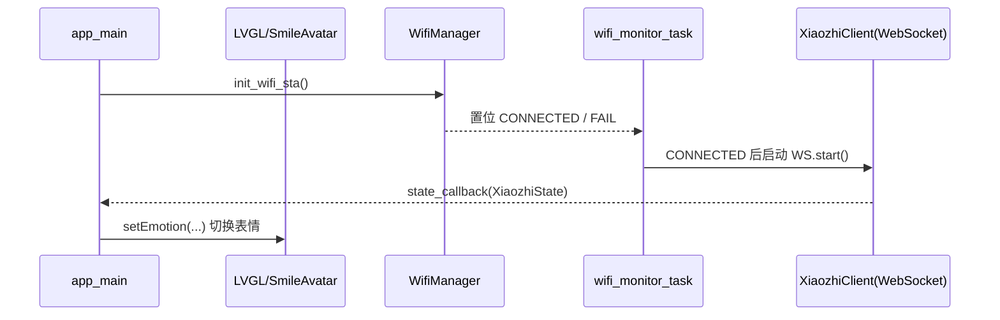
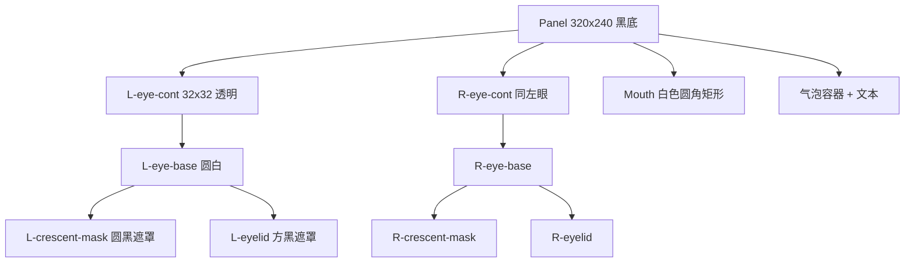

# 工程代码架构（M5StackS3Learn）

本文件概览整个项目的目录组织、第三方依赖（components 与 managed_components）、以及与 xiaozhi-esp32 的关系与集成走向。图示使用 Mermaid。

## 顶层目录结构

```text
e:/ESP/M5StackS3Learn
├─ main
│  ├─ main.cpp                      # 应用入口，初始化显示/音频/UI/网络
│  ├─ CMakeLists.txt                # 组件编译入口，声明依赖
│  ├─ idf_component.yml             # ESP-IDF 组件管理器依赖
│  ├─ board/
│  │  ├─ m5stack_core_s3.cc         # 板级适配/封装（CoreS3）
│  │  ├─ cores3_audio_codec.*       # 音频 codec 适配（可选/预留）
│  │  ├─ config.h / config.json     # 板级配置（可选/预留）
│  │  └─ README.md                  # 板级说明
│  ├─ ui/
│  │  └─ SmileAvatar.hpp           # 表情头像 UI（LVGL 封装）
│  └─ network/
│     ├─ WifiManager.hpp           # Wi‑Fi STA 初始化与事件回调
│     ├─ XiaozhiClient.hpp/.cpp    # WebSocket 客户端，驱动“小智”状态
├─ components/                      # 第三方依赖的本地拉取目录（由脚本获取）
├─ managed_components/              # ESP-IDF 组件管理器自动下载目录（构建生成）
├─ xiaozhi-esp32/                   # 外部工程（音频管线/资产/板级支持示例）
├─ repos.json                       # 第三方仓库清单（手动拉取配置）
├─ fetch_repos.py                   # 拉取/更新第三方依赖脚本
├─ README.md
└─ CodeArchitecture                 # 本文件
```

## 依赖来源

- 官方依赖（由 ESP-IDF 组件管理器下载）
  - 列于 [main/idf_component.yml](file:///e:/ESP/M5StackS3Learn/main/idf_component.yml)
  - 示例：`lvgl/lvgl`、`espressif/m5stack_core_s3`、`espressif/esp_codec_dev`、`espressif/esp_audio_codec`、`espressif/esp_websocket_client`、`espressif/cjson`
  - 下载到 `managed_components/`

- 第三方依赖（手动拉取至 components/）
  - 清单见 [repos.json](file:///e:/ESP/M5StackS3Learn/repos.json)，通过 [fetch_repos.py](file:///e:/ESP/M5StackS3Learn/fetch_repos.py) 获取
  - 当前配置：
    - components/mooncake（UI/框架）
    - components/mooncake_log（日志/格式化）
    - components/smooth_ui_toolkit（LVGL 的 C++ 封装）
    - components/ArduinoJson（JSON 库）
    - components/esp-now（Espressif 官方 ESP-NOW 组件）
    - components/espressif__esp-sr（语音唤醒/多命令等）
    - xiaozhi-esp32（外部项目，路径在仓库根目录）

## 主项目模块关系

```mermaid
graph TD
  A[main 组件] --> B[LVGL (managed_components)]
  A --> C[smooth_ui_toolkit (components)]
  A --> D[esp_wifi (managed_components)]
  A --> E[nvs_flash (managed_components)]
  A --> F[esp_codec_dev / esp_audio_codec (managed_components)]
  A --> G[esp_websocket_client (managed_components)]
  A --> H[cJSON (managed_components)]

  subgraph Board
    L[main/board/*]
  end

  subgraph UI
    I[SmileAvatar.hpp]
  end

  subgraph Network
    J[WifiManager.hpp]
    K[XiaozhiClient.hpp/.cpp]
  end

  A --> I
  A --> J
  A --> K
  A --> L
```

## 运行时数据流（Wi‑Fi 与 WebSocket）



## UI 组件（头像）结构概览



## xiaozhi-esp32 结构与定位

`xiaozhi-esp32/` 是一个外部项目，包含更完整的音频服务管线、资产与多板型配置，便于后续深度集成。主要结构：

```text
xiaozhi-esp32/
├─ main/
│  ├─ audio/                 # 音频编解码接口/唤醒词适配/处理器
│  ├─ boards/                # 各开发板适配（如 box/cores3 等）
│  ├─ assets/                # 声音资源（提示音/多语言）
│  ├─ application.*          # 应用层入口与服务调度
│  ├─ CMakeLists.txt
│  └─ Kconfig.projbuild
├─ docs/                     # 协议/连线/板级说明等
├─ CMakeLists.txt
└─ README*.md
```

若需要与当前工程更深入联动（如直接复用其音频服务），建议：

- 以组件方式引入其关键模块或提供接口层
- 保持与 `esp_codec_dev`、`esp_websocket_client` 的资源互斥（避免音频设备冲突）
- 统一事件/状态机：用“小智状态”驱动 UI 表情与提示音

## board/ 目录定位

`main/board/` 用于放置与具体开发板（此处为 CoreS3）相关的适配层与可选的“替换实现”，常见用途：

- 封装板级差异（GPIO、外设初始化策略、外设选择）
- 提供音频 codec 的替换实现/适配（与 BSP 或外部项目保持接口一致）
- 承载板级配置（例如与 menuconfig 对应的配置模板、硬件参数等）

当前工程主入口主要使用 `m5stack_core_s3` BSP 的 `bsp_*` 接口；`board/` 更偏向后续扩展与对接 `xiaozhi-esp32` 的音频/板级架构时使用。

## 构建入口与依赖声明

- [main/CMakeLists.txt](file:///e:/ESP/M5StackS3Learn/main/CMakeLists.txt)
  - 源文件：`main.cpp`、`network/XiaozhiClient.cpp`
  - REQUIRES：`lvgl`、`smooth_ui_toolkit`、`esp_lcd_touch`、`esp_wifi`、`nvs_flash`、`esp_codec_dev`
- [main/idf_component.yml](file:///e:/ESP/M5StackS3Learn/main/idf_component.yml)
  - 组件管理器依赖（官方注册表）
- 第三方依赖
  - [repos.json](file:///e:/ESP/M5StackS3Learn/repos.json) + [fetch_repos.py](file:///e:/ESP/M5StackS3Learn/fetch_repos.py)

## 典型开发流程摘要

1) 拉取代码
2) 手动拉取第三方依赖：`python fetch_repos.py`
3) 拉取官方依赖：`idf.py reconfigure`（或 `idf.py build` 自动拉取）
4) 目标设置/编译/烧录/监视：
   - `idf.py set-target esp32s3`
   - `idf.py build`
   - `idf.py -p COMx flash monitor`
